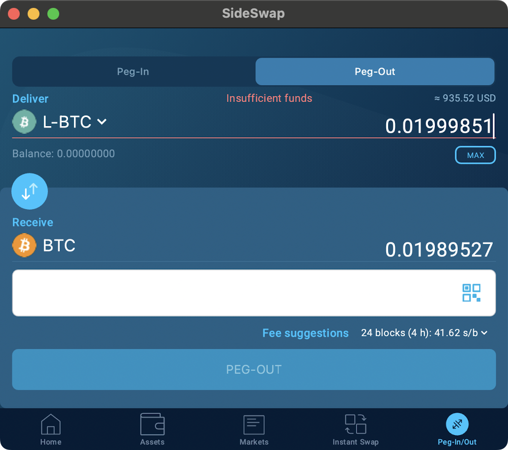
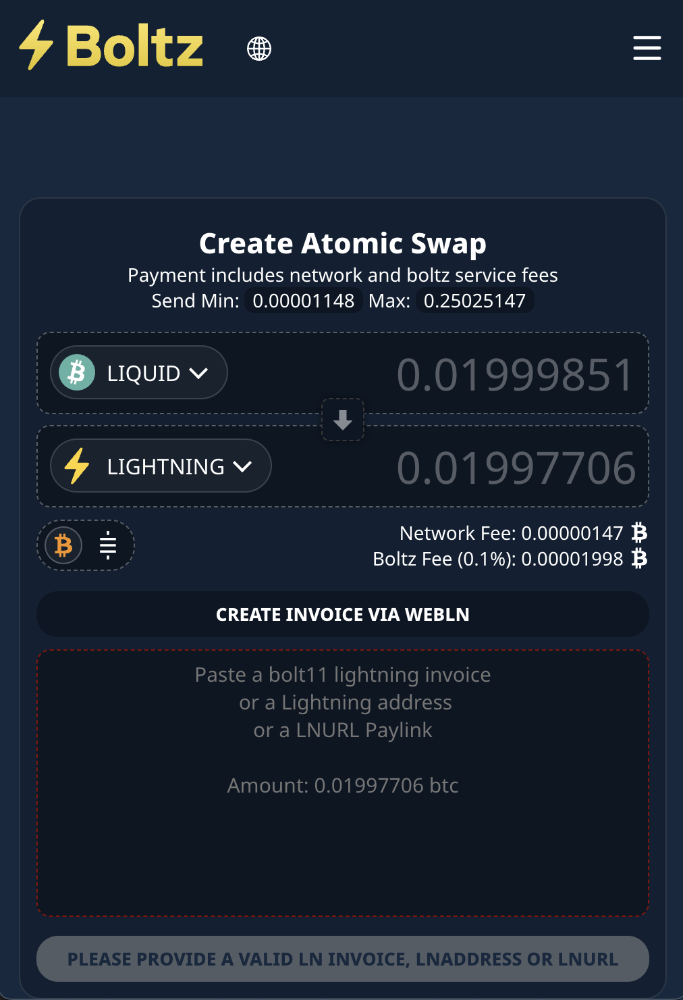
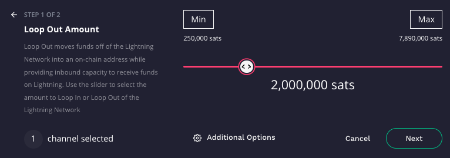
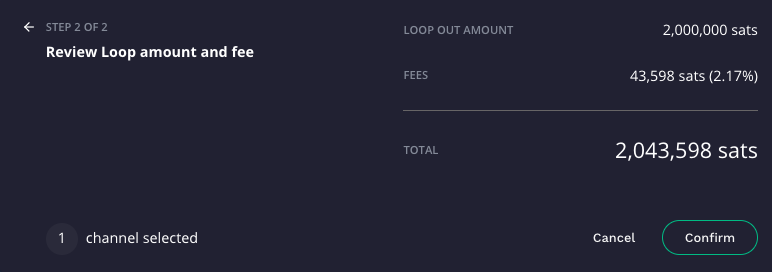

# PeerSwap Economics

Following up on [the previous post](https://github.com/zapomatic/zapomatic/blob/main/PeerSwap.md) about using [PeerSwap](https://github.com/ElementsProject/peerswap) to move 2M sats from [Zap-O-Matic](https://amboss.space/node/026d0169e8c220d8e789de1e7543f84b9041bbb3e819ab14b9824d37caa94f1eb2) to [FriendsPool](https://amboss.space/node/023e24602891c28a7872ea1ad5c1bb41abe4206ae1599bb981e3278a121e7895d6), let's dive deeper into how this process went, the cost of running a [swap out](https://github.com/ElementsProject/peerswap/blob/master/docs/peer-protocol.md#swap-out-1) and how this compares to using [Loop Out](https://lightning.engineering/loop/) as a way of moving liquidity from outbound to inbound at a reasonable cost to the node operator.

We are going to use examples from nodes that [Zap-O-Matic](https://amboss.space/node/026d0169e8c220d8e789de1e7543f84b9041bbb3e819ab14b9824d37caa94f1eb2) is connected to, but keep in mind that the true cost of Loop Out is dependent on both Bitcoin on-chain fees, the LOOP fee, and the egress fees of ALL the partner nodes that sit between your node and the LOOP out destination, so your own node calculations will be different than ours, but you will likely find that no matter what your costs are, the difference between using PeerSwap and Loop is significant.

> NOTE: it is recommended that before you use L-BTC you ensure that you have a way to move L-BTC back and forth between BTC, which we show later in the article. See:
> https://help.blockstream.com/hc/en-us/articles/900001387106-How-do-I-convert-L-BTC-to-BTC-

First, let's go over exactly how the PeerSwap `swap out` went in detail, and then we will compare it to a Loop Out.

## PeerSwap `swap out`

As discussed before, the `swap out` was initiated by [Zap-O-Matic](https://amboss.space/node/026d0169e8c220d8e789de1e7543f84b9041bbb3e819ab14b9824d37caa94f1eb2) using the following comand:

```
$ pscli swapout --sat_amt=2000000 --channel_id=905006921533161472 --asset=lbtc
```

This immediately returned the following to the cli output:

```
{
  "swap": {
    "id": "5c426a6f99a6aaaf8a4446d77b80a6778dcd4a2bee0ae50dbdf89cadd558df1c",
    "created_at": "1704669067",
    "asset": "lbtc",
    "type": "swap-out",
    "role": "sender",
    "state": "State_SwapOutSender_AwaitTxConfirmation",
    "initiator_node_id": "026d0169e8c220d8e789de1e7543f84b9041bbb3e819ab14b9824d37caa94f1eb2",
    "peer_node_id": "023e24602891c28a7872ea1ad5c1bb41abe4206ae1599bb981e3278a121e7895d6",
    "amount": "2000000",
    "channel_id": "823099:3393:0",
    "opening_tx_id": "b29f8dfea29b22b153ccf23122216b6f8d422d240268f2753ae67640b4dbb3e7",
    "claim_tx_id": "",
    "cancel_message": "",
    "lnd_chan_id": "905006921533161472"
  }
}
```

Next step, we took a look at the status and, nearly instantly, [FriendsPool](https://amboss.space/node/023e24602891c28a7872ea1ad5c1bb41abe4206ae1599bb981e3278a121e7895d6) had accepted:

```
$ pscli listswaps
```

returned:

```
{
  "swaps": [
    {
      "id": "5c426a6f99a6aaaf8a4446d77b80a6778dcd4a2bee0ae50dbdf89cadd558df1c",
      "created_at": "1704669067",
      "asset": "lbtc",
      "type": "swap-out",
      "role": "sender",
      "state": "State_ClaimedPreimage",
      "initiator_node_id": "026d0169e8c220d8e789de1e7543f84b9041bbb3e819ab14b9824d37caa94f1eb2",
      "peer_node_id": "023e24602891c28a7872ea1ad5c1bb41abe4206ae1599bb981e3278a121e7895d6",
      "amount": "2000000",
      "channel_id": "823099:3393:0",
      "opening_tx_id": "b29f8dfea29b22b153ccf23122216b6f8d422d240268f2753ae67640b4dbb3e7",
      "claim_tx_id": "4581fffa0e36f8f3f9d482418b79b29ef712c1fb59582d78b535fa0307a8fa02",
      "cancel_message": "",
      "lnd_chan_id": "905006921533161472"
    }
  ]
}
```

And we got an alert that our node sent over the `330 sat` fee to cover the initial liquid transaction. As the initiator of the request, we pay the Liquid on-chain fees:



The transaction went out, and it only required `285 sats` on the liquid sidechain:
https://liquid.network/tx/b29f8dfea29b22b153ccf23122216b6f8d422d240268f2753ae67640b4dbb3e7

So what happened to the other `45 sats`? Our partner gets to keep that. Fees are still being figured out in PeerSwap as this is a nascent tool.

> Note how the transaction amounts are confidential. Also, note that [liquid chain fees are also variable](https://help.blockstream.com/hc/en-us/articles/900001386846-How-do-transaction-fees-on-Liquid-work-) so it will be interesting to see how this cost changes as PeerSwap grows in popularity.

After 2 minutes, the liquid network processed the transaction and we shot over the 2M sats:


And then our L-BTC processed, which required another `148 sats`: https://liquid.network/tx/4581fffa0e36f8f3f9d482418b79b29ef712c1fb59582d78b535fa0307a8fa02

And we could now see the L-BTC balance in our wallet:

```
$ pscli lbtc-getbalance
{
  "sat_amount": "1999851"
}
```

Now there is a little discrepancy in the sub-sat appearance of the chain fees. What we got was `1,999,851 sats`, but that's 2,000,000 minus `149`, so it looks like there was a sub-sat rounding error in reporting. We can accept this though as it means that we still only paid `330` + `149` = `479 sats!` to get move the liquidity for `2M sats` over and collect the L-BTC.

_But now what?_

The most sensible option is to hold onto this L-BTC until we want to do a `swap in` to another channel where we have too much inbound liquidity and trade them our L-BTC for their LN BTC. Or we could wait for a channel partner to issue a `swap out` and they pay the ~`500 sats`. We can move this L-BTC back and forth with our PeerSwap enabled peers forever, using this as our primary way to cheaply rebalance our channels.

But let's say we don't like to hold onto L-BTC and we want to move it right over to BTC because that's what LOOP Out does and we want that BTC to open another channel right now. So let's do that.

Without really making this transaction (because we really do want to hold the L-BTC for the next rebalance), here's what it would look like to swap that L-BTC for BTC using [SideSwap](https://sideswap.io/):


> NOTE: SideSwap has odd fixed fee options in the UI and they had misread the current fee estimates for the Bitcoin on-chain, which at the time of measuring this was closer to 32 sat/vB, but we chose the lowest SideSwap option of `41.62 sat/vB` to see what the cost would be.

Here we can see that if we SideSwap `0.01999851` L-BTC at a bitcoin chain fee rate of `41.62 sat/vB`, we will get `0.01989527` BTC back. That adds a `10,324 sats` fee to our entire process of going from outbound LN BTC liquidity to on-chain BTC.

But here’s the kicker. It would have cost _the same_ to move `20M sats` or `200M sats` to on-chain BTC in this way.

So that means the entire PeerSwap to BTC swap out process to get an _arbitrary amount of sats_ from our side of a node to on-chain bitcoin was

`330` + `149` + `10324` = `10,803 sats`

We could also choose to swap our Liquid BTC for LN BTC using Boltz:



But this is another thread that we will have to dig into later.

## Comparing to Loop Out

Let's take one of the channel partners that Zap-O-Matic is connected to that has a direct connection to LOOP. Rather than going through a command-line soup with pages of output, let's use the LOOP out UI and get a quote:

First, we select a channel to LOOP out from, and for consistency, we are going to set it to 2M sats:


and click next:




> What the Fun?! `43,598 sats?!`

But here's another kicker. Not only will it cost us `32,795 sats` more to use LOOP out, we would be creating artificial traffic on the lightning network pushing our liquidity problem to other nodes on the network!

If you are only concerned with getting more inbound liquidity, at this fee rate, you could just buy a 2.5M inbound liquidity channel from Magma, get better connected. and see if one of those sources will naturally feed into your node and out through the channel where you have too much outbound liquidity.

## Rebalancing and LOOP are Parasites on the Network

Until PeerSwap, Loop Out was really the best way to get your bitcoin back on-chain so you could cycle through opening channels in batch and maintaining liquidity balance, but now it's _not_ the best way. Use PeerSwap.

Some node runners are big fans of active rebalancing. But here's why rebalancing is clearly bad for the network:

Let's say you created a triangle swap with two other nodes and you all did the "right" thing by dropping your fees to zero so one of you could do a `lncli buildroute` and move funds in a circle back to themselves and now you are all wonderfully balanced.

```
A <[50%]-[50%]> B <[50%]-[50%]> C<[50%]-[50%]> A
```

Great right? But then time goes on. And you are not only connected to each other. Soon it looks like this:

```
A <[90%]-[10%]> B <[70%]-[30%]> C<[60%]-[40%]> A
```

Notice that we did not get out of balance equally. This is because each node is connected to many other nodes and is moving liquidity to other places, not just along our triangle.

So now `A` cleverly uses `rebalance-lnd` to move liquidity and maybe it finds that A -> B -> C -> A is the best route, so it moves 40% over in that direction:

```
A <[50%]-[50%]> B <[30%]-[70%]> C<[20%]-[80%]> A
```

Look A<->B is now balanced! But at what cost?


In all seriousness, here's how we just made a mess of everything:

1. We had to pay the fees that `B` charges to move to `C` and that `C` charges to move back to us (`A`)
2. We balanced our channel at the cost of un-balancing `B` and `C`'s channels
3. We created artificial traffic on the network that was not needed, which now poisons the ability for `B` and `C` to automate fee calculations that they base on assumptions of legitimate traffic
4. Now our peers are going to rebalance their channels and end up off-setting the balance we just made, creating a circle jerk of fake traffic where we all profit (and ultimately lose) from each other's need to try to find balance (fake revenue)
5. It gets worse because frequently rebalances don't use a simple 3 node circle but use 5 or 6 nodes to create the "balance"

So that's it. Use PeerSwap and stop rebalancing. Stop using LOOP as soon as your peers support PeerSwap.

Open a channel to [Zap-O-Matic](https://amboss.space/node/026d0169e8c220d8e789de1e7543f84b9041bbb3e819ab14b9824d37caa94f1eb2) and the other [Liquid PeerSwap enabled community](https://amboss.space/community/181aad24-1871-4be9-ab6d-10ac71383c42) to join the revolution.

## Errata / Debugging Notes

From M2Node + The Wall:

- Make sure your channel is configured to allow min_htlc_msat less than 300000 msat (300 sats) or you will get an error like this:

```
rpc error: code = Unknown desc = no matching outgoing channel available for node 0
```
